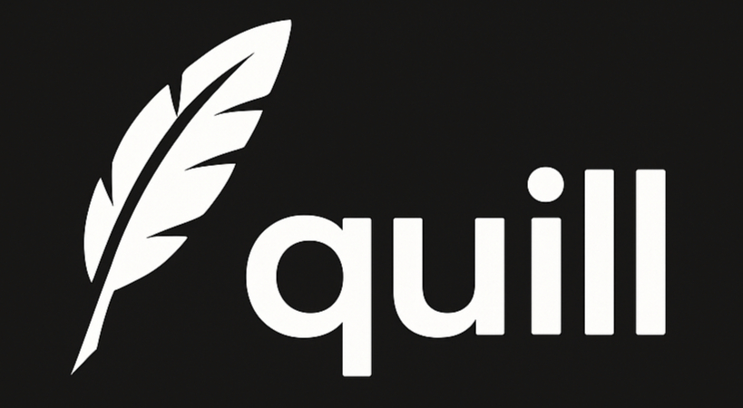

[](https://github.com/bim-dev-tools/quill/actions/workflows/ci.yaml/badge.svg)

# Quill



Quill is a fast, modern static site generator and SPA blog engine written in Go. It features live reload, markdown support, and easy configuration for rapid blogging and publishing.

## Features

- **Markdown-based posts**: Write your content in markdown files.
- **Single Page Application**: Fast navigation and dynamic content loading.
- **Live reload**: Instant updates during development.
- **Configurable build and server**: Customize output and dev experience.
- **Easy initialization**: Quickly scaffold a new site with one command.
- **Syntax highlighting**: Prism.js integration for code blocks.
- **Responsive design**: Mobile-friendly out of the box.

## Getting Started

### Installation

#### Recommended: One-Line Install

You can install the latest Quill release with a single command:

```sh
curl -fsSL https://github.com/bim-dev-tools/quill/releases/latest/download/install.sh | bash
```

This script will automatically detect your OS and architecture, download the latest release, and install it to `/usr/local/bin/quill` (or the appropriate location).

#### Manual Install (Advanced)

Clone the repository and build the binary:

```sh
git clone https://github.com/bim-dev-tools/quill.git
cd quill
go build -o quill
```

### Initialize a New Site

Run the following command in your target directory:

```sh
quill init
```

This will create:

- `index.html` (SPA entry point)
- `styles.css` (default styles)
- `.gitignore`
- `posts/0001_hello_world.md` (example post)

### Development Server

Start the live-reload development server:

```sh
quill server
```

- Visit `http://localhost:8080` (default port) in your browser.
- Edit markdown files in `posts/` and see changes instantly.

### Build for Production

Generate the static site for deployment:

```sh
quill build
```

Output will be in the `build/` directory (default).

## Configuration

Edit `.quill.config.yml` to customize:

```yaml
build_dir: build
html_entry_point: index.html
watch_files:
  - posts/*.md
  - styles.css
  - index.html
server:
  port: 8080
```

## Commands

- `init` — Scaffold a new site in the current directory.
- `server` — Start the live-reload development server.
- `build` — Build the static site for deployment.

## Design Philosophies

### Don’t scale

No bells, no whistles. Minimal dependencies. Generate small, focused blogs that do one thing well.

### Sensible defaults, flexible when needed

Everything is configurable, but nothing has to be. Start simple, customize only if you want.

### Posts aren’t programs

Content should stay close to raw text. The tooling gets out of the way so you can focus on words, not code.

### Just write

The workflow should encourage writing, not configuring. Remove friction, remove distractions.

## Contributing

Pull requests and issues are welcome! Please see the code in `cmd/`, `transpiler/`, `server/`, and `utils/` for entry points and architecture.

## License

MIT
